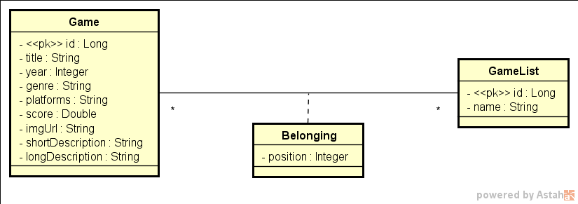
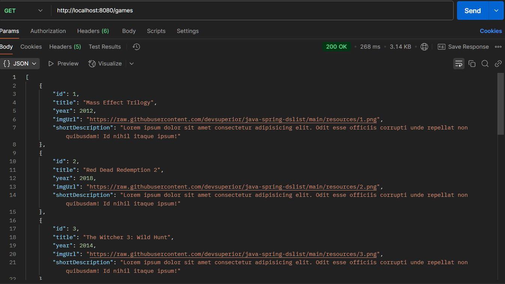
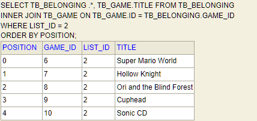
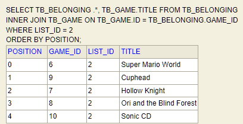

# GameList 🎮

GameList é uma API backend desenvolvida para gerenciar uma lista de jogos. Ela permite visualizar os jogos e reorganizá-los alterando suas posições na lista. O projeto foi construído como parte de um aprendizado em **Java com Spring Boot**, demonstrando boas práticas no desenvolvimento de APIs RESTful.

---

## 🖥️ Modelo de domínio GameList



---

## 📋 Funcionalidades

- Visualizar uma lista de jogos;
- Alterar a posição dos jogos na lista.

---

## 👀 Visualizar uma lista de jogos



---

## Alterar a posição dos jogos na lista

Original:



Alterada:



---

## 🚀 Tecnologias Utilizadas

- **Java 21**
- **Spring Boot**
- **JPA / Hibernate**
- **Banco de Dados H2**
- **Spring Web**
- **Spring Data JPA**

---

## 🛠️ Como Rodar o Projeto

### Clonar o Repositório

```bash
git clone https://github.com/victorribeirog/GameList.git
cd GameList
